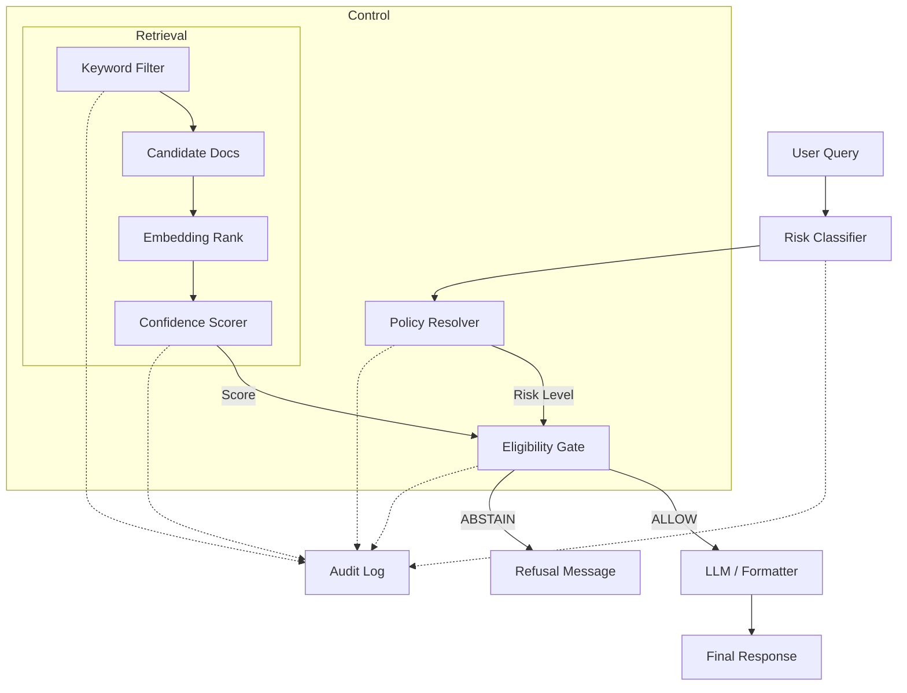

# LLM Control Plane

> **Release: v0.5.0 — Controlled Inference with Verified Bytez API Embeddings**
> **Type: Deterministic, audit-first control plane for LLMs**


## What’s new in v0.5.0
- Verified Bytez SDK embeddings with working model `sentence-transformers/all-MiniLM-L6-v2`.
- Resilient Bytez encoder: normalizes responses, surfaces provider errors, and guards missing config.
- Environment defaults for Bytez in `.env` and `.env.example` for drop-in use.
- UI polish: decision trace, semantic color system, Inter + JetBrains Mono typography.
- CORS-enabled FastAPI backend; frontend and backend run side-by-side without blocked calls.

## System overview
Deterministic pipeline that refuses unsafe or low-confidence queries:
- Risk classifier → Policy resolver → Hybrid retrieval (keywords + embeddings) → Confidence scorer → Eligibility gate → LLM formatter (optional).
- `ABSTAIN` is an intentional outcome; policy and intent override evidence.
- All decisions are auditable; retrieval and confidence never bypass policy gates.

### Architecture (mermaid)


### Governance principles
- Intent-first: advisory or sensitive intent triggers policy veto regardless of confidence.
- Evidence is bounded: retrieval cannot override policy; embeddings improve ranking only.
- Confidence collapse: nonsense or low-signal queries yield ABSTAIN instead of hallucination.
- Auditability: every gate logs its decision for traceability.

### Validation matrix
| Test case | Query | Outcome | Driver |
| --- | --- | --- | --- |
| Low-risk factual | "What is AI?" | ALLOW | Keywords match, confidence high, risk low |
| Advisory intent | "Should I invest?" | ABSTAIN | Intent detected, policy veto |
| Nonsense | "Explain quantum pizza" | ABSTAIN | Confidence collapses, no grounded docs |

## Quick start
1) Clone and install
```bash
git clone https://github.com/STiFLeR7/llm-control-plane.git
cd llm-control-plane
python -m venv .venv
.\.venv\Scripts\activate
pip install -r requirements.txt
```

2) Configure env
- Copy `.env.example` to `.env` and set:
  - `BYTEZ_API_KEY=<your_key>`
  - `EMBEDDING_BACKEND=bytez`
  - `BYTEZ_EMBEDDING_MODEL=sentence-transformers/all-MiniLM-L6-v2`
- If Bytez plan is inactive, switch to `EMBEDDING_BACKEND=local`.

3) Run backend
```bash
uvicorn app.api.server:app --reload --port 8000
```

4) Run frontend (Turbopack)
```bash
cd llm-control-plane-ui
npm install
npm run dev
```

## Embedding backends
- **Bytez (default)**: Uses official SDK; tested with `sentence-transformers/all-MiniLM-L6-v2`. See [app/embeddings/bytez.py](app/embeddings/bytez.py#L1-L54).
- **Local**: `sentence-transformers` on-device; set `EMBEDDING_BACKEND=local`.
- Swap models at runtime by passing `model_override` to the factory.

### Bytez embedding flow
1. SDK auth with `BYTEZ_API_KEY`.
2. Load model `BYTEZ_EMBEDDING_MODEL` (default MiniLM-L6-v2 at 384 dims).
3. `model.run(text)` → normalized output via encoder guardrails.
4. Errors from provider are surfaced; plan/activation issues are not swallowed.

## Validation
- `tests/test_bytez.py`: Verifies Bytez SDK path end-to-end (requires active plan).
- Pipeline invariants: advisory intent → policy veto; nonsense → confidence collapse; factual → ALLOW when confidence high.

## UI snapshots
- ALLOW: factual query with high confidence shows evidence, metrics, and answer in [assets/WhatisAI.png](assets/WhatisAI.png).
- ABSTAIN: advisory query refusal with policy badge in [assets/ShouldIinvest.png](assets/ShouldIinvest.png).

## Key files
- [app/config.py](app/config.py#L1-L26): Settings, defaults, backend selection.
- [app/embeddings/bytez.py](app/embeddings/bytez.py#L1-L54): Bytez encoder with response normalization.
- [app/embeddings/factory.py](app/embeddings/factory.py#L1-L20): Backend selector.
- [llm-control-plane-ui/app/page.tsx](llm-control-plane-ui/app/page.tsx): Decision trace UI.

## Troubleshooting
- **Bytez error about plan**: Activate a plan or set `EMBEDDING_BACKEND=local`.
- **CORS issues**: Backend must run on `http://localhost:8000`; frontend on `http://localhost:3000`.
- **Model mismatch**: Ensure `embedding_dim=384` aligns with MiniLM.

## License
MIT
