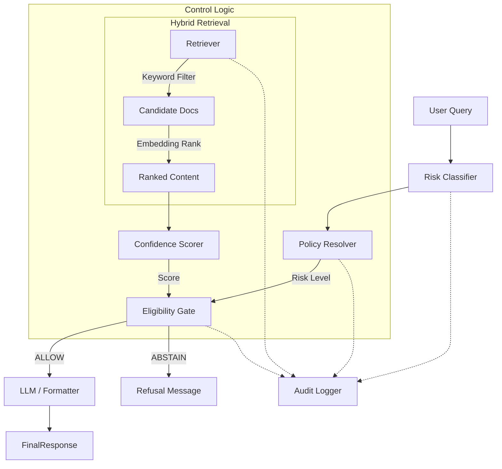

# LLM Control Plane

> **Status: Phase 6B.7 — SUCCESSFULLY VALIDATED**  
> **Type: Controlled Inference Platform**


## 📖 Overview

The **LLM Control Plane** is a deterministic, audit-first system designed to govern Large Language Model (LLM) interactions. Unlike standard RAG demos, this platform treats LLMs as optional *formatters* rather than decision agents. It enforces strict invariants around **risk**, **policy**, and **retrieval confidence** before any generation is allowed.

This system is built to solve the "last mile" problem of enterprise AI: **Control**. It ensures that:
- **Intent overrides evidence**: Advisory queries on sensitive topics (Financial, Medical, Legal) are blocked regardless of retrieved context.
- **No hallucination surface**: Nonsense queries result in confidence collapse and refusal.
- **Auditability**: Every decision—from risk classification to final eligibility—is logged authoritatively.

---

## 🏗 Architecture

The system operates on a linear, gated pipeline where every stage must pass for generation to occur.



---

## 🚀 Key Features

### 1. Hybrid Retrieval Engine
Combines the precision of **embeddings** with the authority of **keyword filtering**.
- **Stage 1 (Filter)**: Hard keyword intersection to guarantee candidate relevance (`app/retrieval/retriever.py`).
- **Stage 2 (Rank)**: `sentence-transformers` (local) to rank candidates by semantic similarity.
- **Result**: Ranking improves recall, but does not override the fundamental keyword authority.

### 2. Deterministic Risk Classification
Uses a regex-driven heuristic engine (`app/core/risk_classifier.py`) to categorize intent.
- **Advisory Intent**: Questions like *"Should I invest?"* trigger high-risk flags.
- **Topic Separation**: Distinguishes between asking *about* "stocks" (Information) vs. asking for *advice* "should I buy stocks" (Advisory).

### 3. Policy Gating
Policy is the ultimate arbiter (`app/core/policy_resolver.py`).
- **High Risk**: Immediate `ABSTAIN`.
- **Low Confidence**: `ABSTAIN` (prevents hallucination on nonsense queries like "quantum pizza").
- **Allowed**: Only low-risk, high-confidence queries proceed to generation.

### 4. Confidence Scoring
Calculates a normalized confidence score based on retrieval density and semantic alignment (`app/retrieval/confidence.py`). This prevents the system from answering when it simply *doesn't know*.

---

## 🛠️ Validation Metrics (Phase 6B.7)

The system has been validated against three core invariants:

| Test Case | Query Type | Outcome | Reason |
| :--- | :--- | :--- | :--- |
| **Low-risk factual** | "What is AI?" | `ALLOW` | Keywords matched, Confidence high, Risk low. |
| **Advisory intent** | "Should I invest?" | `ABSTAIN` | **Intent detected**. Policy vetoed generation despite retrieval content. |
| **Nonsense** | "Explain quantum pizza" | `ABSTAIN` | **Confidence collapsed**. No grounded candidates found. |

**Key Takeaway**: Embeddings improved capability without weakening control. Intent overrides evidence.

---

## 💻 Tech Stack

- **Language**: Python 3.10+
- **Embeddings**: `sentence-transformers` (Local), support for API-based backends.
- **Vector Store**: In-Memory (for speed and determinism), extensible to FAISS/Chroma.
- **Architecture**: Modular, Interface-based (`app/core`, `app/retrieval`, `app/generation`).
- **Deployment**: Docker-ready structure (stateless application logic).

---

## ⚡ Quick Start

### Prerequisites
- Python 3.10+
- `pip`

### Installation

1. **Clone the repository**
   ```bash
   git clone https://github.com/your-org/llm-control-plane.git
   cd llm-control-plane
   ```

2. **Install dependencies**
   ```bash
   pip install -r requirements.txt
   ```
   *Note: Ensure `sentence-transformers`, `numpy`, and standard utils are installed.*

3. **Run the Application**
   ```bash
   python -m app.main
   ```

### Configuration
Edit `app/config.py` to adjust system settings:

```python
@dataclass(frozen=True)
class Settings:
    environment: str = "local"
    embedding_backend: str = "local" # or "api"
    embedding_dim: int = 384     # aligned with all-MiniLM-L6-v2
```

---

## 📂 Directory Structure

```plaintext
llm-control-plane/
├── app/
│   ├── audit/          # Authoritative logging
│   ├── core/           # Risk, Policy, and Eligibility logic
│   ├── embeddings/     # Embedding factories (Local/API)
│   ├── generation/     # LLM integration point
│   ├── policies/       # Policy definitions
│   ├── retrieval/      # Hybrid retrieval engine
│   └── main.py         # Pipeline entry point
├── docs/               # Documentation
├── tests/              # Unit and integration tests
└── scripts/            # Setup and utility scripts
```

---

## 🤝 Contributing

1. **Audit First**: Any new feature must be logged in `app/audit`.
2. **Determinism**: Avoid introducing non-deterministic logic in `app/core`.
3. **Tests**: Run `pytest` before submitting PRs.

---

**© 2025 llm-control-plane | STiFLeR7**
